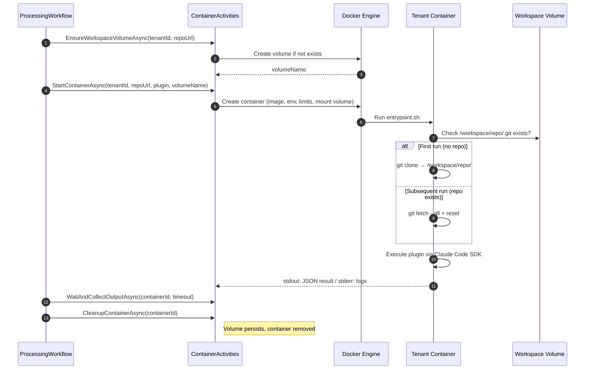

## Problem Statement

Without isolation, all agent logic runs in the same host process, which means:

- **No filesystem isolation** — tenant repos would share the host filesystem.
- **No process isolation** — a misbehaving plugin in one tenant could crash or compromise another.
- **No resource isolation** — one tenant's workload could starve others of CPU/memory.
- **Credential leakage risk** — secrets available to one tenant could be accessed by another.

## Design Goals

| Goal | Description |
|------|-------------|
| **Security isolation** | Each tenant execution runs in its own container with no access to other tenants' data, credentials, or processes. |
| **Filesystem isolation** | Each tenant+repo pair gets its own persistent volume. No tenant can access another's volume. |
| **Resource limits** | CPU, memory, and disk can be capped per container to prevent noisy-neighbour effects. |
| **Credential scoping** | Only the credentials required for a specific tenant/repo are injected into that container. |
| **Ephemeral containers, persistent workspaces** | Containers are short-lived — created per processing event, destroyed after completion. The workspace volume (cloned repo) persists across requests to avoid redundant cloning. |
| **Full internet access** | Containers have full outbound internet access. Isolation is at the container/tenant boundary, not the network boundary. |

## Architecture Overview

```
┌─────────────────────────────────────────────────────────────────────┐
│  Host: .NET Agent (Control Plane)                                   │
│                                                                     │
│  ┌──────────────┐  ┌────────────────────┐  ┌────────────────────┐  │
│  │ XianixAgent   │  │ ActivationWorkflow │  │ EventOrchestrator  │  │
│  └──────────────┘  └────────────────────┘  └────────────────────┘  │
│                            │                                        │
│                    ┌───────▼────────┐                               │
│                    │ ProcessingWF   │                               │
│                    └───────┬────────┘                               │
│                            │ Docker API                             │
├────────────────────────────┼────────────────────────────────────────┤
│            Docker Engine   │                                        │
│                                                                     │
│   Persistent Volumes (per tenant+repo):                             │
│   ┌───────────────────────────────┐                                 │
│   │  vol: tenant-abc_repo-xyz     │  ← survives container restarts  │
│   │  /workspace/repo/  (cloned)   │                                 │
│   └──────────────┬────────────────┘                                 │
│                  │ mounted into                                      │
│   ┌──────────────▼────────────────────────────────────────┐         │
│   │  Tenant Container (ephemeral)                          │         │
│   │  git fetch · Claude Code SDK · Plugin Execution        │         │
│   │  Full internet access (public network)                 │         │
│   └────────────────────────────────────────────────────────┘         │
└──────────────────────────────────────────────────────────────────────┘
```

**Key design principles:**

- **Containers are ephemeral** — spun up per event, torn down after completion.
- **Workspace volumes are persistent** — each tenant+repo combination gets a named Docker volume. Subsequent requests do a fast `git fetch` instead of a full clone.
- **Full internet access** — containers have unrestricted outbound networking.
- **Full tool access** — the Claude Code SDK is invoked without artificial tool restrictions. The container is the sandbox.

## Container Security Configuration

| Setting | Value | Rationale |
|---------|-------|-----------|
| `NetworkMode` | `bridge` (default) | Full outbound internet access. |
| `Memory` | `512MB–2GB` (configurable) | Prevent OOM on host. |
| `PidsLimit` | `256` | Prevent fork bombs. |
| `SecurityOpt` | `no-new-privileges` | Prevent privilege escalation. |
| `User` | Non-root (`1000:1000`) | Least privilege. |
| `CapDrop` | `ALL` | Drop all Linux capabilities. |
| `Volumes` | Named volume → `/workspace` | Persistent workspace, scoped to tenant+repo. |

## What a Container Cannot Do

- Access the Docker socket (no container escape).
- Access the host network namespace (isolated bridge network).
- Reach other tenant containers directly (no inter-container routing).
- Access host filesystem outside its mounted volume.

## Volume Naming

**Volume naming convention:** `xianix-{tenantId}-{repoHash}` ensures each tenant+repo pair gets its own isolated persistent storage.

| Event | Action |
|-------|--------|
| First request for a tenant+repo | Create named volume. Container clones repo into it. |
| Subsequent requests | Reuse existing volume. Container does `git fetch` + checkout. |
| Tenant offboarded | Delete the volume (admin/cleanup activity). |

## Container Lifecycle



## Timeout & Failure Handling

| Scenario | Handling |
|----------|----------|
| Container exceeds timeout | `WaitAndCollectOutputAsync` kills the container after the configured deadline. Workflow reports timeout with any partial stderr output. |
| Plugin execution fails (exit code != 0) | Workflow reports failure with stderr diagnostics. Volume persists; repo state is reset on next run via `git reset --hard`. |
| Docker daemon unavailable | `StartContainerAsync` fails. Temporal retries per `RetryPolicy` (3 attempts, exponential backoff). |
| Container OOM killed | Docker reports OOM exit. Workflow reports resource limit exceeded. |
| Corrupted volume (bad git state) | Entrypoint detects and falls back to fresh clone. |

## Secret Management

Secrets are shared across all tenants — there are no per-tenant vaults. The appropriate platform token is selected based on the `platform` input extracted from the webhook event.

| Secret | Purpose | When Injected |
|--------|---------|---------------|
| `LLM_API_KEY` | Claude / LLM API access | Always |
| `GITHUB_TOKEN` | GitHub API access | When `platform == "github"` |
| `AZURE_DEVOPS_TOKEN` | Azure DevOps API access | When `platform == "azuredevops"` |
| `PLATFORM` | Identifies the CM platform for this execution | Always |
