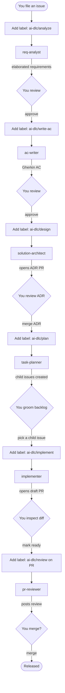
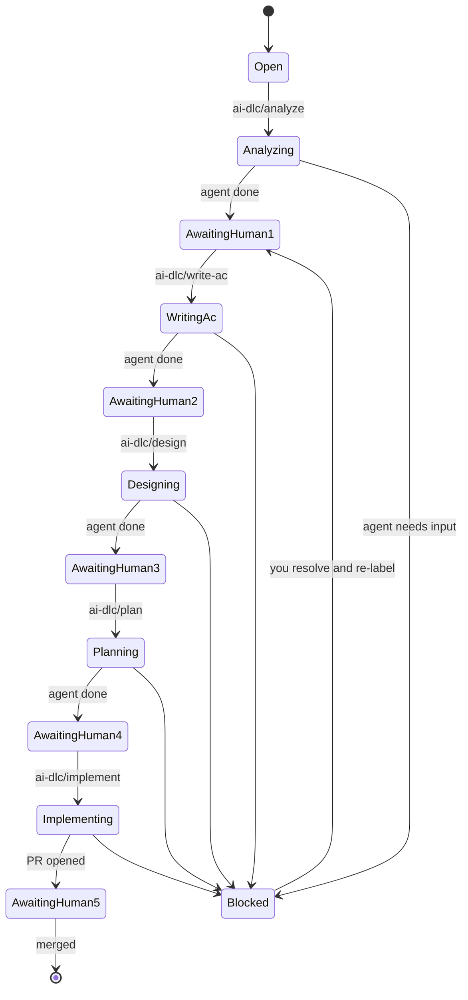
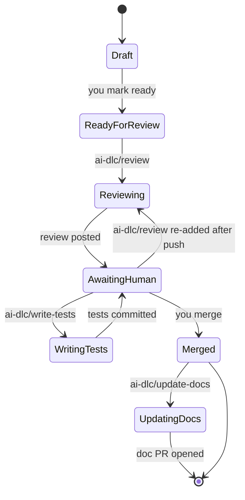
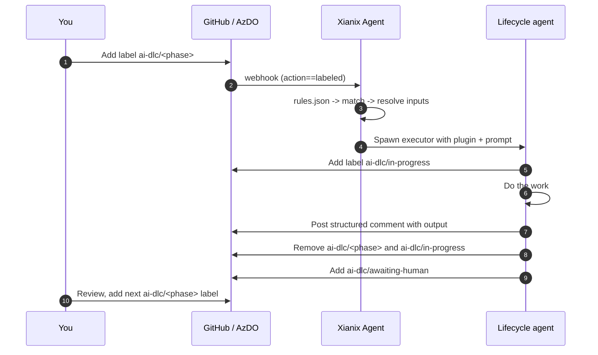
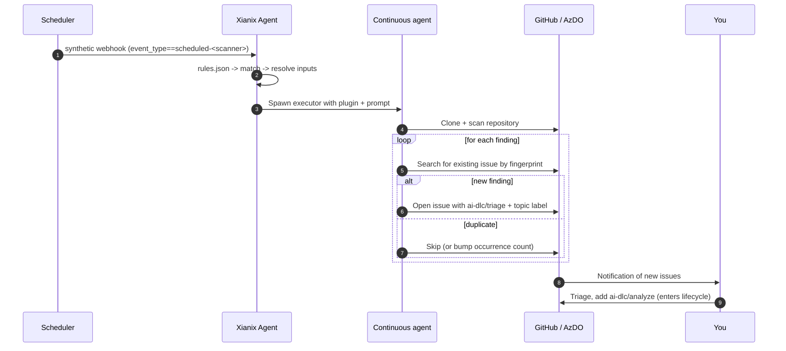

The **Agent Team** is the Xianix marketplace's complete **AI Development Lifecycle (AI-DLC)** — a cast of focused AI agents that pick up work where the previous one left off, validate each other, and hand back to a human at every step. Think of it as a relay race where each runner is an expert in one phase, and the baton is always a label on a GitHub issue or pull request.

:::tip[The core idea: ping-pong]
You add a label, an agent does the work, removes the label, and posts its output. You review, then add the *next* label. Humans set the pace; agents do the heavy lifting. No agent ever skips ahead on its own.
:::

---

## Two classes of agents

The team has two complementary modes of operation.

### Lifecycle agents — label-triggered

| Agent | Brief description |
| --- | --- |
| `req-analyst` | Turns a raw idea into structured requirements and clarifications. |
| `ac-writer` | Writes Gherkin-style acceptance criteria from agreed requirements. |
| `solution-architect` | Proposes a solution design and records it (e.g. as an ADR). |
| `task-planner` | Splits an epic or large item into smaller, trackable child issues. |
| `implementer` | Implements the change and opens or updates a draft pull request. |
| `pr-reviewer` | Runs a full review: quality, security, tests, and performance. |
| `test-author` | Adds or extends automated tests where coverage is missing. |
| `doc-writer` | Updates user-facing or internal docs to match the change. |
| `bug-triager` | Classifies incoming bugs, severity, and suggested routing. |
| `postmortem-writer` | Drafts a structured postmortem after an incident. |

**Lifecycle agents** form the linear ping-pong from idea to deployed code. They only run when *you* apply a label.

### Continuous review agents — scheduled

| Agent | Brief description |
| --- | --- |
| `security-scanner` | Scans for vulnerabilities, secrets, and insecure patterns. |
| `performance-scanner` | Flags hotspots, regressions, and inefficient code paths. |
| `test-coverage-scanner` | Surfaces untested or weakly tested areas. |
| `dependency-scanner` | Reports outdated, vulnerable, or conflicting dependencies. |
| `doc-drift-scanner` | Detects documentation that no longer matches the code. |
| `dead-code-scanner` | Finds unused modules, exports, or unreachable paths. |
| `flaky-test-scanner` | Identifies unstable or order-dependent tests. |

**Continuous review agents** patrol the repo on a schedule, find problems on their own, and *enter* the lifecycle by opening already-labelled issues or PRs. They never silently change your code.

---

## The shared language: `ai-dlc/*` labels

Every handoff in the system is a single label. The same vocabulary works on GitHub labels and Azure DevOps tags.

| Group | Label | Meaning |
|---|---|---|
| **Issue phase** | `ai-dlc/analyze` | Elaborate this raw idea into structured requirements |
| | `ai-dlc/write-ac` | Turn requirements into Gherkin acceptance criteria |
| | `ai-dlc/design` | Propose a solution design (ADR) |
| | `ai-dlc/plan` | Break this epic into child issues |
| | `ai-dlc/implement` | Open a draft PR that implements this |
| | `ai-dlc/triage` | Classify and route this incoming bug |
| | `ai-dlc/postmortem` | Draft a postmortem for this incident |
| **PR phase** | `ai-dlc/review` | Run a full code review on this PR |
| | `ai-dlc/write-tests` | Add the missing tests on this PR |
| | `ai-dlc/update-docs` | Open a follow-up PR to update the docs |
| **Status (set by agents)** | `ai-dlc/in-progress` | An agent is currently running |
| | `ai-dlc/awaiting-human` | An agent is done; your move |
| | `ai-dlc/blocked` | An agent needs your input to continue |
| | `ai-dlc/done` | Pipeline complete for this artifact |
| **Modifiers** | `ai-dlc/force` | Bypass safety checks (e.g. self-review block) |
| | `ai-dlc/dry-run` | Show what would happen without making writes |

:::note[Label = consent]
An agent only acts when **you** apply its trigger label. Removing the label is the agent's signal that it has finished. This makes the entire system auditable — every action by an AI is preceded by a human label change.
:::

---

## Meet the lifecycle agents

The full lineup, in the order they typically appear during a feature's life.

### Phase 1 — Discovery and requirements

#### `req-analyst` *(label: `ai-dlc/analyze`)*

The first responder to a fresh idea. Reads the raw issue, asks "what does the user actually need and why," and produces a structured elaboration covering intent, domain, user journey, persona, and gap analysis. See the dedicated [Requirement Analyst](/official-plugins/req-analyst/) page for the multi-phase analyst breakdown.

#### `ac-writer` *(label: `ai-dlc/write-ac`)*

Turns approved requirements into precise Given/When/Then scenarios. Output is editable Gherkin you can drop straight into your test suite.

### Phase 2 — Design

#### `solution-architect` *(label: `ai-dlc/design`)*

Proposes a concrete approach: an Architecture Decision Record (ADR), a Mermaid component sketch, and a list of files likely to change. Opens the ADR as its own PR so the design itself goes through the standard review loop.

### Phase 3 — Planning

#### `task-planner` *(label: `ai-dlc/plan`)*

Splits an approved epic into individually actionable child issues, copies the AC into each, and links them back to the parent. You prune the backlog, then assign whichever children you want to pick up.

### Phase 4 — Implementation

#### `implementer` *(label: `ai-dlc/implement`)*

The big one. Opens a branch, writes the code and tests against the agreed AC, and pushes a **draft** PR. Always draft — a human inspects the diff before flipping it to ready-for-review.

### Phase 5 — Review

#### `pr-reviewer` *(label: `ai-dlc/review`)*

Runs four reviewers in parallel — code quality, security, test coverage, performance — and posts a unified review comment. Full details on the dedicated [PR Reviewer](/official-plugins/pr-reviewer/) page.

#### `test-author` *(label: `ai-dlc/write-tests`)*

When a PR is missing test coverage, this agent commits the missing tests directly to the PR branch.

#### `doc-writer` *(label: `ai-dlc/update-docs`)*

After a code-changing PR merges, opens a follow-up PR that updates `Docs/` and READMEs to match.

### Phase 6 — Operations

#### `bug-triager` *(label: `ai-dlc/triage`)*

For incoming bugs (whether reported by a human or escalated by a continuous scanner): classifies severity, asks reproduction questions, suggests an owner from `CODEOWNERS`, and prepares the issue for the lifecycle.

#### `postmortem-writer` *(label: `ai-dlc/postmortem`)*

After an incident is resolved, drafts a postmortem PR — timeline, root cause, action items — ready for the team to refine.

---

## Meet the continuous review agents

These agents do not wait for you. They run on a schedule (or on every push to `main`), scan the repository, and turn every finding into a labelled issue or auto-PR. Findings are de-duplicated by a stable fingerprint embedded in each issue body, so reruns never spam.

| Agent | Suggested cadence | What it watches | How it escalates |
|---|---|---|---|
| `security-scanner` | nightly + on push to main | Source, dependencies, IaC, secrets | Issue with `security` + `ai-dlc/triage` |
| `performance-scanner` | weekly | Hot paths, N+1 queries, bundle size | Issue with `performance` + `ai-dlc/triage` |
| `test-coverage-scanner` | nightly | Uncovered branches, missing edge cases | Issue with `testing` + `ai-dlc/triage`, or auto-PR with `ai-dlc/review` |
| `dependency-scanner` | daily | Outdated packages, deprecated APIs, CVEs | Auto-PR with `ai-dlc/review` for safe bumps; issue otherwise |
| `dead-code-scanner` | weekly | Unreferenced symbols, unused exports | Issue with `cleanup` + `ai-dlc/triage` |
| `doc-drift-scanner` | weekly | Docs out of sync with code | Issue with `docs` + `ai-dlc/triage` |
| `flaky-test-scanner` | continuous (CI hook) | Tests that fail intermittently | Issue with `flaky` + `ai-dlc/triage` |

:::tip[Continuous → Lifecycle handoff]
When a scanner opens an issue with `ai-dlc/triage`, the `bug-triager` lifecycle agent picks it up — and from there it's a normal ping-pong: triage → analyze → design → plan → implement → review → merge.
:::

---

## The full ping-pong, end to end



Every arrow leaving an agent represents the agent **removing its trigger label**, **posting a structured comment**, and **adding `ai-dlc/awaiting-human`**. Every arrow leaving a human represents a single label change.

---

## Issue lifecycle, as a state machine

The same issue moves through phases by label transitions alone. You can skip phases by jumping straight to a later label.



---

## PR lifecycle, as a state machine



---

## Agent contracts

Every agent follows one of two contracts.

### Lifecycle agent contract



### Continuous review agent contract



---

## What an agent comment looks like

Every lifecycle agent posts in the same shape, so the next step is always obvious:

```markdown
## ai-dlc/analyze result

**Summary:** Elaborated the login requirement into 4 user journeys and 9 acceptance criteria.

**Artifacts:**
- Personas identified: returning user, first-time user, admin
- Open questions: should magic-link expire after 15 or 60 minutes?

**Suggested next step:** add label `ai-dlc/write-ac` to continue, or
`ai-dlc/blocked` if you want me to wait on the open questions.
```

---

## Getting started

1. **Add the marketplace** (if you have not already — see the [Marketplace Overview](/official-plugins/overview/)).

   ```bash
   claude plugin marketplace add xianix-team/xianix-plugins-official
   ```

2. **Seed the labels** in your target repository so the agents have something to react to. A reference script ships with the marketplace.

3. **Wire up the rules.** Each agent in the team has a corresponding execution block for [`rules.json`](/agent-configuration/rules/). The trigger pattern is always the same:

   ```json
   {
     "name": "ai-dlc-<agent>",
     "match-any": [
       {
         "name": "label-added",
         "rule": "action==labeled&&label.name=='ai-dlc/<phase>'"
       }
     ],
     "use-inputs": [
       { "name": "issue-number",   "value": "issue.number" },
       { "name": "trigger-label",  "value": "label.name" },
       { "name": "platform",       "value": "github", "constant": true }
     ],
     "use-plugins": [
       { "plugin-name": "<agent>@xianix-plugins-official" }
     ],
     "execute-prompt": "..."
   }
   ```

4. **(Optional) Schedule the continuous scanners** with a per-repo GitHub Actions cron workflow that emits `repository_dispatch` events of type `scheduled-<scanner>`. A reference workflow ships with the marketplace.

5. **Start using it.** File an issue, add `ai-dlc/analyze`, and let the relay begin.

:::caution[Trust before you ship]
The Agent Team can write code, open PRs, and create issues in your repository. Treat the `GITHUB_TOKEN` / `AZURE_DEVOPS_TOKEN` you give it the same way you'd treat a powerful new teammate's credentials — start with a low-stakes repo, watch a few cycles, then expand.
:::

---

## See also

- [PR Reviewer](/official-plugins/pr-reviewer/) — the deep dive on `pr-reviewer`.
- [Requirement Analyst](/official-plugins/req-analyst/) — the deep dive on `req-analyst`.
- [Marketplace Overview](/official-plugins/overview/) — full plugin index and install instructions.
